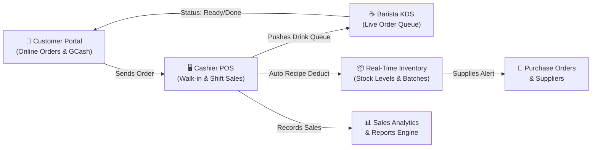
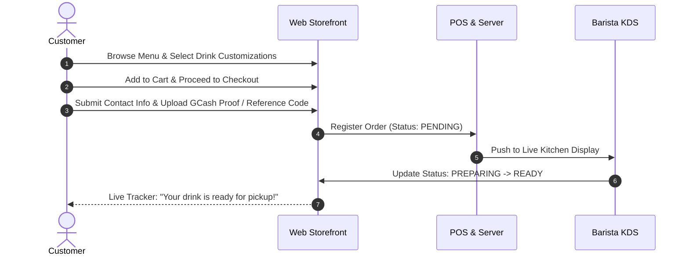
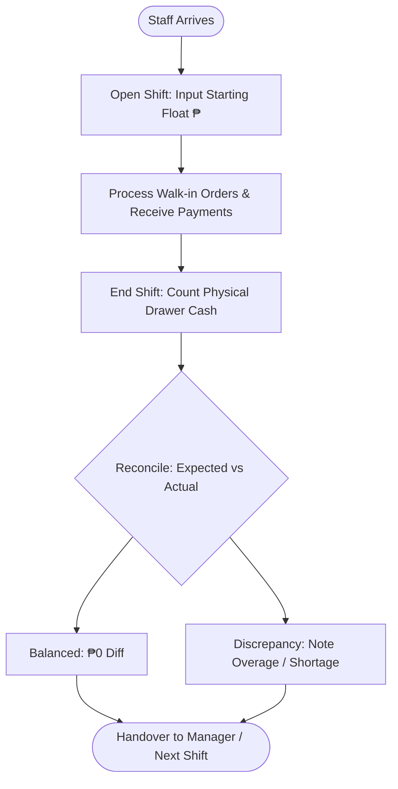
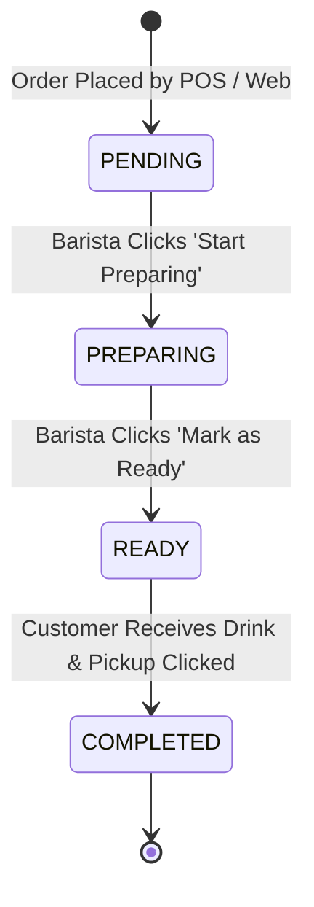
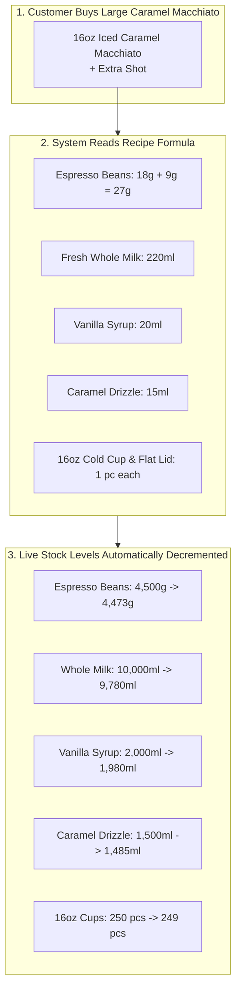
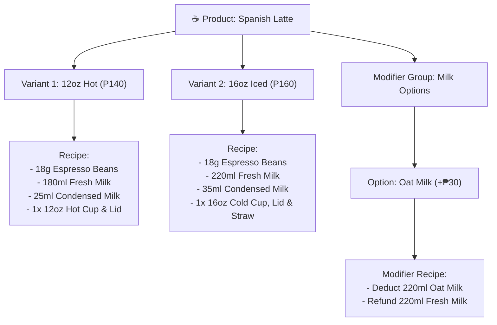

# Basta Kape: Web-Based POS & Inventory Management System

## Official System User Manual & Operating Guide

---

## 1. Introduction & System Overview

Welcome to the **Basta Kape Web-Based Point of Sale (POS) and Inventory Management System**. This digital platform is specifically designed to streamline café operations, eliminate manual paper slips, automate inventory tracking via drink recipes, and provide real-time visibility across front counter sales, kitchen drink preparation, and back-office management.

### 1.1 User Roles & Scope of Access

The system enforces Role-Based Access Control (RBAC). Each account has dedicated permissions tailored to its responsibilities:

| User Role                   | Primary Modules & Responsibilities                                                                                                                                                                                                                          |
| :-------------------------- | :---------------------------------------------------------------------------------------------------------------------------------------------------------------------------------------------------------------------------------------------------------- |
| **Owner**                   | High-level executive oversight, full Sales Analytics (`/admin/sales`), exportable business reports (`/admin/reports`), complete audit activity logs (`/admin/activity-logs`).                                                                               |
| **Administrator / Manager** | Master inventory controls (`/admin/inventory/*`), recipe mapping, menu/product configuration (`/admin/products/*`), purchase orders (`/admin/purchase-orders`), supplier management, user accounts, and RBAC permissions.                                   |
| **Cashier**                 | Front-counter POS checkout (`/admin/pos`), cash drawer shift opening/closing (`/admin/pos`), in-store and online customer order management (`/admin/orders`), payment receipting.                                                                           |
| **Barista**                 | Live kitchen order queue display (`/admin/order-queue`), live drink status progression (`Pending` &rarr; `Preparing` &rarr; `Ready` &rarr; `Completed`), station food preparation/baking batches (`/admin/food-prep`), digital menu lookup (`/admin/menu`). |
| **Customer**                | Online public storefront (`/`), drink customization with modifiers/add-ons, digital shopping cart (`/cart`), GCash payment verification upload (`/checkout`), live order status tracking (`/orders/:id`).                                                   |

---

## 2. Getting Started & Common Features

### 2.1 Accessing the Application

- **Customer Storefront:** Open the store root URL (`/`).
- **Staff / Admin Portal:** Navigate to `/admin/pos` or click **Staff Login** in the upper right.

### 2.2 Authentication & Account Security

1. **Logging In (`/login`):** Enter your assigned `Username` (or `Email`) and `Password`. The system automatically redirects you to your role's default workspace (e.g., POS for Cashier, Order Queue for Barista, Dashboard for Admin/Owner).
2. **Forgot & Reset Password (`/forgot-password`):** Enter your registered email address to receive password recovery instructions and enter your OTP token to set a new password.
3. **Profile Settings (`/admin/profile`):** Update personal details, contact number, avatar, or change your account password.

### 2.3 Navigation & Interface Features

- **Sidebar Navigation:** Use the left collapsible sidebar to switch between operational modules.
- **Theme Toggle:** Switch between Light and Dark modes using the theme switcher located in the top navigation bar.
- **Active System Notifications:** Immediate feedback banners (toasts) notify you of successful orders, stock deductions, or validation errors.

---

## 3. Customer Portal (Online Ordering)

The Customer Portal enables patrons to place orders directly without needing to message social media pages.

### 3.1 Step-by-Step Customer Ordering Flow

#### Step 1: Browse Menu Catalog (`/` and `/products`)

1. Filter drinks by category (e.g., _Espresso_, _Non-Coffee_, _Pastries_, _Refreshers_) or product type (_Beverage_, _Food_).
2. Use the live search bar to search for your favorite drink (e.g., "Spanish Latte").

#### Step 2: Select Variant & Customize Modifiers (`/products/:id`)

1. Click on a product card to open its detail page.
2. Select your preferred **Variant** (e.g., _16oz Iced_ vs _12oz Hot_). The price updates automatically.
3. Choose custom **Modifiers / Add-Ons**:
    - _Milk Alternative:_ Oat Milk, Almond Milk, or Regular Whole Milk.
    - _Syrup Pumps:_ Vanilla, Caramel, Hazelnut (+₱20).
    - _Espresso Shots:_ Extra Espresso Shot (+₱30).
    - _Sweetness Level:_ 100%, 70%, 50%, 0%.
4. Specify special instructions in the text area (e.g., "Less ice please").
5. Click **Add to Cart**.

#### Step 3: Review Shopping Cart (`/cart`)

1. Click the **Cart Icon** in the top navigation bar.
2. Review selected items, quantities, and modifier summaries.
3. Adjust quantities or remove items if necessary.
4. Click **Proceed to Checkout**.

#### Step 4: Checkout & Digital Payment Upload (`/checkout`)

1. Select **Order Type**: `Pick-Up` or `Take-Out`.
2. Enter your **Full Name**, **Contact Number**, and optional pickup time.
3. **GCash Payment:**
    - Scan the shop's official GCash QR code displayed on screen or use the displayed merchant phone number.
    - Pay the exact total amount generated by the checkout screen.
    - Enter your **GCash Reference Number** (13-digit transaction code).
    - Click **Upload Proof of Payment** and attach your GCash transaction screenshot.
4. Click **Place Order**. A unique **Order Reference** and **Queue Number** will be generated.

#### Step 5: Live Order Tracking (`/orders/:id`)

1. After checkout, you are redirected to the Live Tracking Page.
2. The tracker updates in real-time through four stages:
    - 🕒 **Pending:** Cashier is verifying your payment and details.
    - ☕ **Preparing:** Barista has queued and is preparing your drinks.
    - 📦 **Ready for Pickup:** Your order is completed and waiting on the pickup counter.
    - ✅ **Completed:** Order successfully claimed.

---

## 4. Cashier Operations (Point of Sale & Shift Management)

The Cashier Module is optimized for rapid in-store walk-in ordering, fast barcode/item lookups, shift drawer balancing, and payment receipting.

### 4.1 Register Shift Management (`/admin/pos`)

> [!IMPORTANT]
> A cashier **must open a register shift** before processing transactions to ensure the cash drawer is properly audited.

#### Opening a Shift:

1. Navigate to **Point of Sale** (`/admin/pos`).
2. If no shift is open, a modal will prompt you to **Start Register Shift**.
3. Count the starting physical cash (float) in the drawer (e.g., ₱2,000.00).
4. Enter the amount into the **Starting Cash** field and click **Open Register Shift**.

#### Closing a Shift:

1. At the end of your working hours, click **End Shift** in the top bar of the POS screen.
2. The system displays:
    - Starting Cash Float
    - Cash Collected from Sales
    - **Expected Total Cash in Drawer**
3. Perform a physical cash count of your drawer and input the **Actual Cash Amount**.
4. If there is a difference (cash overage or cash shortage), provide an explanatory note in the comments field.
5. Click **Confirm & Close Shift**. The shift report is archived for management review.

---

### 4.2 Processing Walk-In Transactions (`/admin/pos`)

#### Step 1: Building the Cart

1. **Browse Categories:** Click category tabs (_Coffee_, _Non-Coffee_, _Pastries_, _Refreshers_) or type in the search bar.
2. **Select Variant:** When clicking a drink card, select the requested size/temperature (e.g., _Iced 16oz_).
3. **Select Modifiers:** Check requested add-ons (extra espresso shot, caramel drizzle, oat milk substitution).
4. Click **Add to Order**. The item appears in the right-hand cart panel with itemized add-on prices.

#### Step 2: Applying Discounts & Selecting Customer

- **Customer Linking:** Click **Select Customer** to link a registered customer's account for loyalty tracking, or leave as Walk-In.
- **Store Discounts:** If the customer is eligible for a statutory discount (Senior Citizen, PWD) or promotional coupon:
    1. Click **Apply Discount**.
    2. Select the discount type (e.g., _Senior Citizen 20%_, _PWD 20%_, _Staff Discount_).
    3. Enter customer identification details (ID number) if prompted. The system automatically recalculates the net payable amount.

#### Step 3: Payment Processing

1. Click the large **Charge / Pay (₱ Amount)** button.
2. Select the **Payment Method**:
    - 💵 **Cash:** Enter the amount tendered by the customer. The system automatically displays the exact **Change Due**.
    - 📱 **GCash / E-Wallet:** Verify the customer's GCash transfer on the counter phone, enter the reference number, and click Confirm.
    - 💳 **Credit / Debit Card:** Swipe/tap on the card terminal, input the approval code, and confirm.
3. Click **Complete Payment**.
4. The system automatically:
    - Generates the receipt and order queue slip.
    - Transmits the order to the **Kitchen Display System (KDS)**.
    - Deducts all recipe raw materials from **Inventory**.

---

### 4.3 Voiding Orders & Order History (`/admin/orders`)

- To view recent in-store receipts, navigate to **Orders** (`/admin/orders`).
- **Voiding / Cancelling an Order:**
    1. Locate the specific order by Queue Number or Reference ID.
    2. Click **Void Order**.
    3. Select a required void reason (_Customer Cancelled_, _Mistake in Item Entry_, _Payment Issue_).
    4. Once voided, the deducted inventory ingredients are restored back to stock, and the void action is logged in **Activity Logs**.

---

## 5. Barista Operations (Kitchen Display System & Food Prep)

The Barista module keeps drink preparation smooth, eliminates handwriting confusion, and ensures freshness of bakery items.

### 5.1 Kitchen Display System / Order Queue (`/admin/order-queue`)

The KDS board auto-refreshes every few seconds to reflect orders from both the counter POS and online customer storefront.

#### Managing Active Order Cards:

1. **Order Cards Overview:** Each card highlights:
    - **Queue Number** (e.g., `#042`)
    - **Customer Name & Order Type** (`Dine In`, `Take Out`, or `Online Pickup`)
    - **Elapsed Time Timer** (Color-coded: Green = Fresh, Amber = Over 5 mins, Red = Over 10 mins)
    - **Items List:** Quantities, drink variants, and **bolded custom modifiers** (e.g., `OAT MILK`, `NO SUGAR`, `EXTRA ESPRESSO`).
2. **Moving Statuses:**
    - Click **Start Preparing**: Changes badge to `PREPARING` so staff know the drink is underway.
    - Click **Mark Ready**: Changes badge to `READY`. The customer tracker updates, alerting the customer that their order is on the pickup counter.
    - Click **Complete**: Clears the card from the active board once served.

---

### 5.2 Station Food Prep & Display Bakery Batches (`/admin/food-prep`)

Basta Kape tracks freshly prepared display items (e.g., _Croissants_, _Cookies_, _Sandwiches_) that have specific shelf lifetimes.

1. **Bake / Prepare Batch:**
    - Click **Log New Prepared Batch**.
    - Select the product variant (e.g., _Butter Croissant_).
    - Input the quantity prepared (e.g., `12 pcs`).
    - The system records preparation timestamp and calculates the exact expiration time based on preset shelf life (e.g., 48 hours).
2. **Monitoring Freshness:**
    - Batches expiring within the next 2 hours are highlighted with warning badges.
3. **Disposing Expired Pastries:**
    - If pastries pass their expiration without selling, click **Dispose Batch**.
    - Record the disposal reason (_Expired_, _Stale_, _Damaged_).
    - The system removes the batch and logs the loss in the waste records.

---

## 6. Inventory & Stock Management

Basta Kape uses a **Recipe-Linked Inventory System**. You do not manually subtract milk or coffee beans after every cup—the system deducts exact quantities based on the product recipe.

### 6.1 Stock Levels Monitoring (`/admin/inventory/stock-levels`)

- **Status Badges:**
    - 🟢 **SAFE:** Stock is comfortably above the reorder point.
    - 🟡 **CRITICAL / LOW:** Stock has dropped below the minimum threshold. Immediate purchase order recommended.
    - 🔴 **OUT OF STOCK:** Stock is 0. Products depending on this ingredient will warn cashiers upon selection.
- **Search & Filter:** Search by ingredient name, category (_Dairy_, _Syrups_, _Beans_, _Packaging_), or status.

### 6.2 Receiving New Deliveries (`/admin/inventory/transactions`)

When supplier deliveries arrive at the shop:

1. Navigate to **Stock Levels** or **Inventory Transactions**.
2. Click **Log Delivery / Restock**.
3. Select the **Supplier** and invoice/DR reference number.
4. Add items delivered: specify ingredient, quantity received, and cost per unit.
5. Click **Submit Delivery**. Inventory stock levels immediately update.

### 6.3 Logging Waste, Spoilage & Discrepancies (`/admin/inventory/waste-log`)

If milk expires, beans are spilled, or cups are broken:

1. Navigate to **Waste Log** (`/admin/inventory/waste-log`).
2. Click **Log Stock Waste**.
3. Select the ingredient and enter the wasted quantity.
4. Choose the classification:
    - `WASTE`: Spilled drink or espresso grinder calibration waste.
    - `SPOILED`: Milk or ingredient spoiled before expiration.
    - `EXPIRED`: Shelf-life elapsed.
    - `PHYSICAL_COUNT_DISCREPANCY`: Count mismatch found during closing audit.
5. Provide notes and click **Save Log**.

---

## 7. Purchase Orders & Suppliers

Digital purchase orders replace manual phone calls and texting, ensuring shop inventory never runs dry.

### 7.1 Managing Suppliers (`/admin/suppliers`)

- Add vendors with contact person, phone number, email, and payment terms.
- Link specific raw ingredients to each supplier so replenishment lists auto-populate with supplier catalogs.

### 7.2 Creating & Receiving Purchase Orders (`/admin/purchase-orders`)

1. Click **Create Purchase Order**.
2. Select target supplier.
3. Review items below minimum reorder points (the system auto-suggests recommended replenishment quantities).
4. Set expected delivery date and submit as **Draft** or **Approved**.
5. When the supplier arrives with goods, click **Receive Items**, verify actual quantities delivered, and confirm receipt. Stock levels update automatically.

---

## 8. Menu & Product Engineering

Configure drinks, variants, add-on modifiers, and their underlying ingredient consumption formulas.

### 8.1 Adding / Editing Products (`/admin/products`)

1. Navigate to **Products Management** (`/admin/products`) and click **New Product**.
2. Enter **Product Name**, **Description**, upload a photo, and assign **Category** (_Coffee_, _Tea_, _Pastry_) and **Type**.
3. **Configure Variants:**
    - Define sizes or temperatures (e.g., _Regular 12oz_, _Large 16oz_).
    - Set the base selling price for each variant.
4. **Map Variant Recipe:**
    - In the Recipe section, click **Add Ingredient**.
    - Select ingredient from inventory (e.g., _Espresso Beans_).
    - Input exact quantity deducted per order (e.g., `18` with unit `grams`).
    - Repeat for milk, syrups, cups, and lids.
5. **Attach Modifier Groups:**
    - Attach allowed modifier groups (e.g., _Milk Alternatives_, _Extra Pumps_, _Add-on Espresso_).
6. Click **Save Product**.

---

## 9. Sales Analytics & Reporting Engine

The sales module provides a clean, dedicated overview of revenue performance and customer ordering patterns without confusing financial or cost accounting metrics.

### 9.1 Sales Analytics Dashboard (`/admin/sales`)

The Sales Analytics page features 4 core areas:

1. **Top Sales KPI Cards:**
    - **Net Sales:** Actual revenue generated after deducting discounts.
    - **Total / Gross Sales:** Gross sales before discounts with total promotional discounts specified.
    - **Orders Completed:** Total number of completed, paid customer orders.
    - **Average Order Value (AOV):** Average customer spend per transaction.
2. **Daily Sales Revenue Trend Chart:**
    - Interactive Area Chart plotting daily sales revenue curves over the selected date range.
    - **Metric Toggle:** Toggle between **Sales Revenue (₱)** and **Order Volume (#)**.
3. **Operational Sales Breakdown Panels:**
    - **Top 5 Best Sellers:** Ranked list of the café's most popular drinks and food items by units sold and revenue.
    - **Order Types Distribution:** Visual breakdown of sales volume across `Dine In`, `Take Out`, and `Delivery`.
    - **Payment Methods Breakdown:** Distribution of payments processed via `Cash`, `GCash`, and `Card`.
4. **Completed Orders Transaction Table:**
    - Real-time searchable log of all customer transactions with Queue Number, Customer Name, Items, Payment Method, and Total Bill.

---

### 9.2 Generating Formal Export Reports (`/admin/reports`)

For accounting, tax compliance, or owner business audits:

1. Navigate to **Reports** (`/admin/reports`).
2. Select **Report Module** (_Sales Summary_, _Order Transactions_, _Inventory Stock Levels_).
3. Set **Date Range** and optional filters (Category, Payment Method, Cashier).
4. Review the live interactive table preview on screen.
5. Click **Export Report** and select your format:
    - 📑 **Excel Spreadsheet (.xlsx):** For granular data analysis or accounting imports.
    - 📄 **PDF Document (.pdf):** Clean, formatted printable report with company header and timestamp.

---

## 10. User Management & Security Auditing

### 10.1 User Account Management (`/admin/users`)

- Administrators can invite new employees, assign user roles (_Cashier_, _Barista_, _Manager_), and toggle accounts between `Active` and `Archived`.
- Passwords can be reset securely from the user detail view.

### 10.2 System Activity Logs (`/admin/activity-logs`)

- Every critical system action (voiding orders, editing recipes, modifying inventory counts, logging in/out) is recorded in an immutable audit log.
- Displays timestamp, actor username, affected module, IP address, and details of before-and-after values.

---

## 11. Troubleshooting & Frequently Asked Questions (FAQ)

### Q1: The cashier made a mistake on an order item after payment was completed. What should we do?

> **Answer:** If the order has not been prepared yet:
>
> 1. Go to **Orders** (`/admin/orders`).
> 2. Locate the order and click **Void Order**.
> 3. Provide the reason (_Cashier Mistake_).
> 4. The deducted inventory is automatically replenished.
> 5. Create a new, corrected order on the POS.

### Q2: What happens if an ingredient runs out during a busy shift?

> **Answer:**
>
> 1. In **Stock Levels** (`/admin/inventory/stock-levels`), the item will reflect as `OUT OF STOCK`.
> 2. On the POS, any drink recipe requiring this ingredient will display an "Unavailable" warning, preventing accidental sales.
> 3. If an emergency purchase was made from a nearby grocery store, the Manager can use **Adjust Stock** to instantly log the replenishment.

### Q3: How do we handle discrepancies between the cash drawer and system totals during shift close?

> **Answer:**
>
> 1. Re-count the drawer physical cash and verify all GCash and Card transaction slips.
> 2. Enter the actual cash counted into the **Actual Drawer Cash** field.
> 3. If a difference remains, input an explanatory note (e.g., "₱20 discrepancy due to shortage of 5-peso coins").
> 4. Click **Close Shift**. The discrepancy is flagged in the shift report for manager review.

### Q4: An online customer uploaded an invalid or blurred GCash screenshot. What should the cashier do?

> **Answer:**
>
> 1. In **Orders** (`/admin/orders`), open the customer order.
> 2. Inspect the attached payment screenshot and cross-reference the 13-digit GCash Reference Number on the shop's GCash phone.
> 3. If invalid, reject or hold the order and contact the customer via the telephone number provided in their order details.

---

_Basta Kape System User Manual — Version 2.4 — September 2026_
