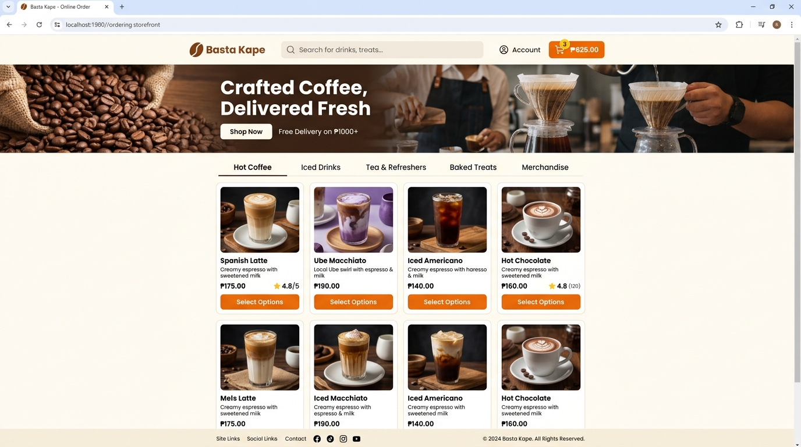
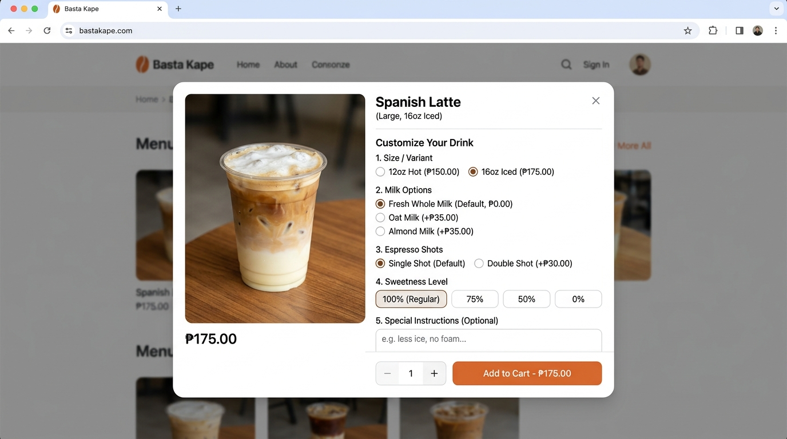
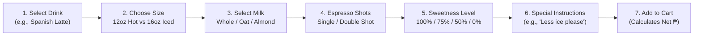
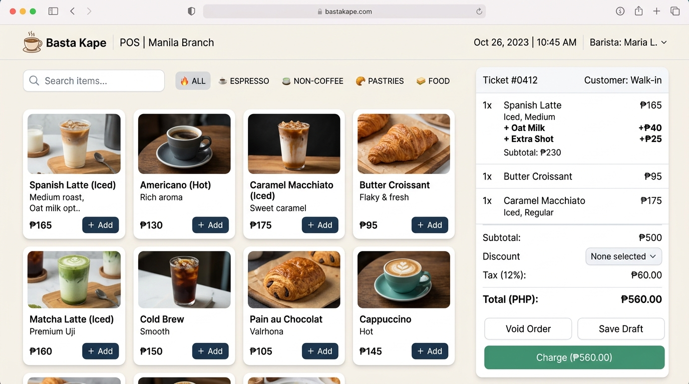
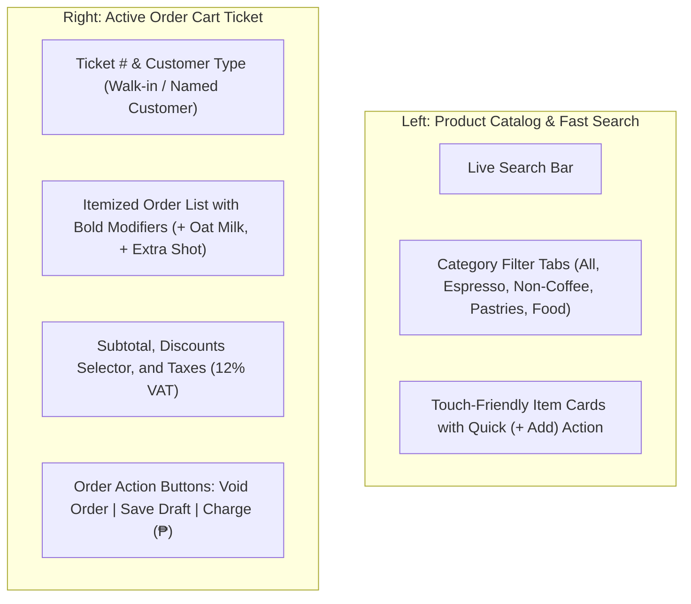

# Basta Kape: Visual User Guide & Illustrated Manual

A visual, step-by-step walkthrough of the **Basta Kape Web-Based POS & Inventory Management System**, featuring direct screenshot references, annotated component callouts, and interface guides for customers, cashiers, baristas, and administrators.

---

## Table of Contents

1. [Customer Portal: Storefront & Menu Catalog](#1-customer-portal-storefront--menu-catalog)
2. [Customer Portal: Drink Customization & Modifiers](#2-customer-portal-drink-customization--modifiers)
3. [Cashier Operations: Point of Sale (POS) Interface](#3-cashier-operations-point-of-sale-pos-interface)
4. [Cashier Operations: Shift Opening & Drawer Balancing](#4-cashier-operations-shift-opening--drawer-balancing)
5. [Barista Operations: Kitchen Display System (KDS / Order Queue)](#5-barista-operations-kitchen-display-system-kds--order-queue)
6. [Inventory Management: Live Stock Levels & Alerts](#6-inventory-management-live-stock-levels--alerts)
7. [Sales Analytics: Executive Sales Performance Dashboard](#7-sales-analytics-executive-sales-performance-dashboard)

---

## 1. Customer Portal: Storefront & Menu Catalog

The Customer Storefront provides a clean, mobile-responsive online ordering experience where remote patrons can browse the menu, customize their beverages, and order without contacting staff through social media.



### 📌 Interface Callout Guide

| Callout           | UI Element                    | Operational Description                                                                                                                                         |
| :---------------- | :---------------------------- | :-------------------------------------------------------------------------------------------------------------------------------------------------------------- |
| **Top Bar**       | **Brand Logo & Navigation**   | Quick access to home, customer account info, and active order tracking.                                                                                         |
| **Search Bar**    | **Live Search Field**         | Instantly filters drinks and food items in real-time as the customer types (e.g., _"Spanish Latte"_, _"Croissant"_).                                            |
| **Header Cart**   | **Shopping Cart Pill Button** | Highlights the current item count (e.g., `3`) and the running bill total (`₱625.00`). Clicking opens the sliding checkout drawer.                               |
| **Banner**        | **Daily Highlights & Promos** | Displays store announcements, featured blends, and special free delivery or bundle discounts.                                                                   |
| **Category Tabs** | **Dynamic Filter Bar**        | One-click categories: `Hot Coffee`, `Iced Drinks`, `Tea & Refreshers`, `Baked Treats`, and `Merchandise`.                                                       |
| **Product Cards** | **Drink & Pastry Showcase**   | Each card displays a high-resolution photo, item title, flavor description, star rating, base price in Philippine Pesos (`₱`), and a **Select Options** button. |

---

## 2. Customer Portal: Drink Customization & Modifiers

When a customer selects a beverage, an interactive modal appears, enabling granular customization of sizes, milks, syrups, and sweetness levels.



### 📌 Customization Workflow



#### Detailed Customization Fields:

1. **Size / Variant Selection:** Radio buttons toggle between standard servings (e.g., `12oz Hot - ₱150.00` vs `16oz Iced - ₱175.00`). Pricing updates dynamically.
2. **Milk Alternatives:** Select standard `Fresh Whole Milk (Default, ₱0.00)` or upgrade to non-dairy alternatives like `Oat Milk (+₱35.00)` or `Almond Milk (+₱35.00)`.
3. **Espresso Dosage:** Choose `Single Shot (Default)` or add extra stamina with `Double Shot (+₱30.00)`.
4. **Sweetness Calibration:** Pill buttons allow quick selection of sugar/sweetener percentages: `100% (Regular)`, `75%`, `50%`, or `0% (Unsweetened)`.
5. **Special Instructions:** An optional text area for custom requests (e.g., _"Extra hot"_, _"Serve with flat lid"_).
6. **Quantity Selector & Add to Cart:** Adjust quantity (`- 1 +`) and click the prominent **Add to Cart (₱ Amount)** button to add the customized item with full recipe specifications.

---

## 3. Cashier Operations: Point of Sale (POS) Interface

The Point of Sale interface (`/admin/pos`) is designed for maximum speed during rush hours, featuring a large touch-friendly menu grid on the left and an active order ticket on the right.



### 📌 Screen Architecture & Walkthrough



#### Key POS Controls:

- **Fast Item Selection:** Click any drink card or click **+ Add** to quickly append standard items to the cart ticket.
- **Active Order Ticket:**
    - Displays assigned Ticket Number (e.g., `Ticket #0412`) and customer association (`Walk-in` or selected member).
    - Lists items with clearly bolded modifiers (`+ Oat Milk +₱40`, `+ Extra Shot +₱25`).
- **Discounts Dropdown:** Easily apply statutory discounts (**Senior Citizen 20%**, **PWD 20%**) or store promotions before final payment.
- **Order Actions:**
    - **Void Order:** Cancels the current ticket and clears items.
    - **Save Draft:** Holds an order if a walk-in customer steps away to get cash.
    - **Charge (₱ Amount):** Opens the payment processing dialog to accept Cash, GCash, or Card.

---

## 4. Cashier Operations: Shift Opening & Drawer Balancing

To guarantee accountability, cashiers must open a register shift with their starting float and reconcile the drawer before signing off.

### 📌 Shift Reconciliation Modal Overview

```
+-------------------------------------------------------------+
|                END REGISTER SHIFT AUDIT                     |
+-------------------------------------------------------------+
| Cashier: Maria Santos           Shift Date: Sep 15, 2026    |
| Started: 07:00 AM               Ending: 03:00 PM            |
+-------------------------------------------------------------+
|  Starting Cash Float:                          ₱  2,000.00  |
|  Total Cash Sales Collected:                  +₱ 14,450.00  |
|-------------------------------------------------------------|
|  EXPECTED CASH IN DRAWER:                      ₱ 16,450.00  |
|                                                             |
|  [ Physical Drawer Count (₱) ]:       [ ₱ 16,450.00 ]       |
|                                                             |
|  Variance / Difference:                        ₱      0.00  |
|  Status:                                       ✓ BALANCED   |
+-------------------------------------------------------------+
|  Closing Notes / Remarks:                                   |
|  [ Drawer balanced. No missing change.                   ]  |
+-------------------------------------------------------------+
|  [ Cancel ]                     [ Confirm & Close Shift ]   |
+-------------------------------------------------------------+
```

#### Step-by-Step Shift Closing:

1. At shift end, click **End Shift** in the top right of the POS header.
2. Count all bills and coins physically present in the cash register.
3. Type the counted total into **Physical Drawer Count**.
4. The system calculates the **Variance**:
    - `₱0.00`: Green balanced indicator.
    - Negative (e.g., `-₱50.00`): Cash shortage alert. Provide explanation in notes.
    - Positive (e.g., `+₱20.00`): Cash overage alert.
5. Click **Confirm & Close Shift**. The shift report is generated and logged in **Activity Logs**.

---

## 5. Barista Operations: Kitchen Display System (KDS / Order Queue)

The Barista Kitchen Display (`/admin/order-queue`) eliminates handwritten paper slips. Orders placed by front-counter cashiers and remote customers appear in real-time.

### 📌 Kitchen Display Board Overview

```
===================================================================================
 KITCHEN DISPLAY SYSTEM (KDS)  |  3 Pending  •  2 Preparing  •  1 Ready  |  [Auto-Sync: ON]
===================================================================================

+----------------------------+  +----------------------------+  +----------------------------+
| QUEUE #0412     [03:45 🟢] |  | QUEUE #0411     [07:20 🟡] |  | QUEUE #0409     [12:10 🔴] |
| Take-Out • Customer: Sarah |  | Dine-In • Table 3          |  | Online Pick-Up • Mark R.   |
| Status: PENDING            |  | Status: PREPARING          |  | Status: READY              |
+----------------------------+  +----------------------------+  +----------------------------+
| 1x Spanish Latte (16oz)    |  | 2x Caramel Macchiato (16oz)|  | 1x Cold Brew (16oz)        |
|    • OAT MILK              |  |    • EXTRA DRIZZLE         |  |    • BLACK / NO SUGAR      |
|    • EXTRA SHOT            |  |    • LESS ICE              |  | 1x Butter Croissant        |
| 1x Butter Croissant        |  |                            |  |                            |
|    • WARMED                |  |                            |  |                            |
+----------------------------+  +----------------------------+  +----------------------------+
|   [ Start Preparing ]      |  |     [ Mark as Ready ]      |  |    [ Complete / Served ]   |
+----------------------------+  +----------------------------+  +----------------------------+
```

### 📌 Drink Preparation Lifecycle

| Status        | Badge Color     | What It Means                                                        | Action Required                                                       |
| :------------ | :-------------- | :------------------------------------------------------------------- | :-------------------------------------------------------------------- |
| **PENDING**   | Blue / Neutral  | New order just entered by POS or confirmed online.                   | Click **Start Preparing** when starting work on the espresso machine. |
| **PREPARING** | Amber / Yellow  | Barista is actively brewing espresso, steaming milk, or plating.     | Click **Mark as Ready** once drinks are placed on the pickup bar.     |
| **READY**     | Green           | Order is complete. Alerts the customer via the live tracking screen. | Hand drinks to customer and click **Complete / Served**.              |
| **COMPLETED** | Gray / Archived | Order successfully picked up.                                        | Removed from active preparation queue board.                          |

---

## 6. Inventory Management: Live Stock Levels & Alerts

Basta Kape links recipes to raw materials. When an order is placed, coffee beans, milk, syrups, cups, and lids are automatically decremented.

### 📌 Stock Levels Monitor (`/admin/inventory/stock-levels`)

```
==========================================================================================
 INVENTORY STOCK MONITOR  |  [ + Log Delivery ]  [ ± Adjust Stock ]  [ 🔍 Search Ingredients ]
==========================================================================================
 Ingredient Name       Category      In Stock       Threshold     Status         Actions
------------------------------------------------------------------------------------------
 Espresso Beans (Dark) Beans         4,473 g        1,500 g       🟢 SAFE        [ Restock ]
 Whole Fresh Milk      Dairy         9,780 ml       3,000 ml      🟢 SAFE        [ Restock ]
 Barista Oat Milk      Dairy           660 ml       1,000 ml      🟡 CRITICAL    [ Reorder ]
 Vanilla Syrup         Syrups        1,980 ml         500 ml      🟢 SAFE        [ Restock ]
 16oz Cold Cups        Packaging        24 pcs        100 pcs     🔴 OUT OF STOCK[ Expedite]
 Flat Plastic Lids     Packaging       249 pcs        100 pcs     🟢 SAFE        [ Restock ]
 Paper Straws          Packaging       450 pcs        150 pcs     🟢 SAFE        [ Restock ]
==========================================================================================
```

### 📌 Status Threshold Legend:

- 🟢 **SAFE:** Current stock is well above the reorder point. Normal operations.
- 🟡 **CRITICAL:** Stock has fallen below minimum safety levels. Recommended to draft a Purchase Order to suppliers.
- 🔴 **OUT OF STOCK:** Zero stock remaining. The POS automatically displays a warning if cashiers attempt to order drinks requiring this item.

---

## 7. Sales Analytics: Executive Sales Performance Dashboard

The Sales Analytics interface (`/admin/sales`) is dedicated solely to sales performance, revenue trends, top-selling items, and transaction logs without confusing expenditure or P&L metrics.

### 📌 Sales Dashboard Overview

```
==========================================================================================
 SALES ANALYTICS  |  [ Today ]  [ 7 Days ]  [ 30 Days ]  |  [ 2026-08-16 to 2026-09-15 ]
==========================================================================================

 [ NET SALES ]            [ TOTAL / GROSS SALES ]  [ ORDERS COMPLETED ]  [ AVG ORDER VALUE ]
 ₱ 142,850.00             ₱ 148,200.00             892 orders            ₱ 160.15
 Revenue after discounts  Discounts: ₱ 5,350.00    Total paid customer   Avg customer spend

------------------------------------------------------------------------------------------
 DAILY SALES REVENUE TREND                          [ Sales Revenue (₱) ]  [ Order Count (#) ]
------------------------------------------------------------------------------------------
 ₱8k |                          ╭──╮
 ₱6k |                ╭─────────╯  ╰──╮
 ₱4k |        ╭───╮  ╭╯               ╰──╮
 ₱2k |   ╭────╯   ╰──╯                   ╰──────╮
  ₱0 └───┴───────┴───────┴───────┴───────┴───────┴───
       Aug 16  Aug 22  Aug 28  Sep 03  Sep 09  Sep 15

------------------------------------------------------------------------------------------
 TOP 5 BEST SELLERS          ORDER TYPES BREAKDOWN        PAYMENT METHODS
------------------------------------------------------------------------------------------
 1. Spanish Latte (Iced)     Dine-In:  48% (₱68,568)      GCash / E-Wallet: 54% (₱77,139)
 2. Caramel Macchiato        Take-Out: 36% (₱51,426)      Cash Payment:     40% (₱57,140)
 3. Butter Croissant         Delivery: 16% (₱22,856)      Card (Debit/Visa): 6% (₱ 8,571)
 4. Cold Brew Reserve
 5. Matcha Latte (Uji)
==========================================================================================
```

### 📌 Key Capabilities:

- **Preset Timeframe Buttons:** Instantly filter data for `Today`, `7 Days`, or `30 Days`, or pick custom calendar ranges.
- **Pure Revenue Metrics:** Inspect clean numbers for Net Revenue, Gross Sales, Total Discounts, and Average Order Value.
- **Interactive Trend Toggle:** Switch between analyzing daily cash revenue flow (₱) and daily order volume counts (#).
- **Channel Insights:** Understand the proportion of Dine-in vs Take-out vs Online orders, and identify customers' preferred payment channels.

---

_Basta Kape System Illustrated Visual Guide — Document Version 1.0 — September 2026_
